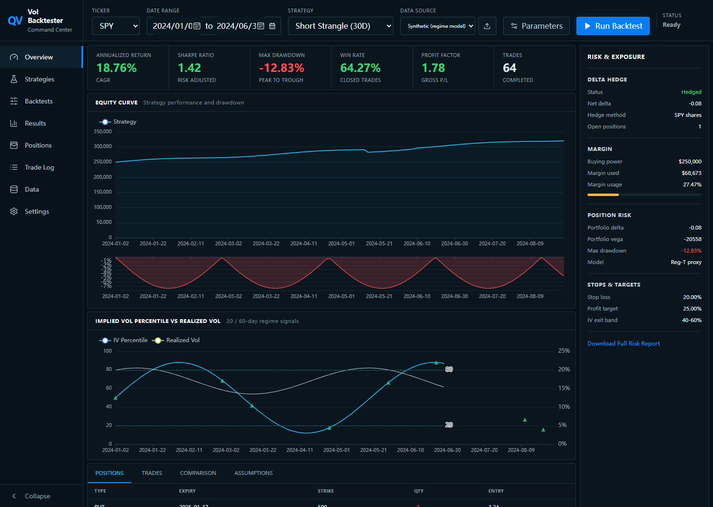

# Volatility Trading Backtest

[中文](#中文说明) · [English](#english)



## 中文说明

这是一个面向交易岗、量化研究岗面试展示的 SPY 期权波动率策略回测系统。项目把
“波动率建模 → 交易信号 → 组合构建 → 执行与风控 → 绩效评估 → 交互展示”放进同一套
可复现工程中。

> 仓库自带数据是固定随机种子的**合成期权链**。示例结果不是实盘收益，也不是投资建议。

### 核心能力

- 自定义轻量日频事件回测框架，不依赖 Backtrader、Zipline。
- 20/60 日 IV 分位和 `IV - RV20` z-score 波动率因子。
- 多/空跨式、多/空宽跨式、牛市认购价差、熊市认沽价差。
- T 日收盘信号、T+1 成交，避免前视偏差。
- 可选每日 Delta 对冲，计入期权/标的手续费与滑点。
- 最多五个并发组合，按剩余组合保证金和单笔风险预算共同确定仓位。
- Reg-T 风格保证金代理、止盈止损、DTE 和持有期退出。
- 年化收益、最大回撤、夏普、胜率、盈亏比、Profit Factor、交易次数。
- FastAPI、CLI、参数扫描、Markdown/CSV/JSON/PNG 报告。
- React + ECharts Trading Command Center，支持真实本地回测。

### 快速开始（Windows / Quant1.0）

```powershell
E:\anaconda\envs\Quant1.0\python.exe -m pip install -e ".[dev]"
cd apps\web
npm install
```

启动 API：

```powershell
E:\anaconda\envs\Quant1.0\python.exe -m uvicorn apps.api.main:app --host 127.0.0.1 --port 9000
```

启动前端：

```powershell
cd apps\web
npm run dev
```

打开 `http://127.0.0.1:5173`。Windows 当前排除 `7895–8094` 端口，因此开发配置使用
`9000`，公开 API 路径仍为 `/api/v1`。

运行 CLI：

```powershell
E:\anaconda\envs\Quant1.0\python.exe -m volbacktest.cli run --config examples\sample-config.json
E:\anaconda\envs\Quant1.0\python.exe -m volbacktest.cli sweep --config examples\sample-config.json --grid examples\sweep-grid.json
```

### 策略逻辑

| 状态 | 确认条件 | 默认交易 |
| --- | --- | --- |
| 高 IV | 20/60 日 IV 分位 ≥ 80，IV-RV z-score ≥ 1 | 卖出跨式/宽跨式 |
| 低 IV | 20/60 日 IV 分位 ≤ 20，IV-RV z-score ≤ -1 | 买入跨式/宽跨式 |
| 低 IV + 方向观点 | 低 IV 信号配合看涨或看跌观点 | 牛市认购或熊市认沽借记价差 |

默认在 IV 分位回到 40–60、剩余 5 DTE、持有 10 个交易日、止损或止盈时退出。
完整配置可由 API/CLI 修改，主要策略与风控参数也可在仪表盘中调整。

### 数据契约

真实 CSV 至少需要：

```text
date,expiry,option_type,strike,bid,ask,implied_volatility,underlying_price
```

详见 [docs/data-contract.md](docs/data-contract.md)。市场数据使用 bid/ask；缺失 Greeks
才用 Black-Scholes 重算。

### 局限性

- SPY 期权为美式期权，本项目用含股息率 Black-Scholes 近似，不模拟提前行权。
- 合成数据用于验证框架和策略行为，不能代表真实成交质量。
- 保证金是公开、可解释的 Reg-T 风格代理，不等于券商 SPAN/组合保证金。
- Delta 对冲不消除 Gamma、Vega、跳空、流动性和模型风险。
- 单标的日频回测不处理盘中路径、订单簿冲击和部分成交。

## English

An interview-ready SPY options volatility strategy research platform. A custom Python
event engine owns data, factors, strategy construction, execution, risk, performance,
and reporting. FastAPI and the CLI share the same service layer, while React/Vite
provides the interactive Trading Command Center.

### Architecture

```text
Synthetic chain / CSV
        |
        v
Validation -> IV/RV factors -> Strategy legs -> T+1 execution
        |                              |
        v                              v
Black-Scholes Greeks             Risk & margin
        \                              /
         ------> Daily event engine <-
                     |
          Metrics, trades, exposures
                     |
        CLI / FastAPI / Reports / React
```

### Development checks

```powershell
E:\anaconda\envs\Quant1.0\python.exe -m pytest --cov=volbacktest --cov-report=term-missing
E:\anaconda\envs\Quant1.0\python.exe -m ruff check .
cd apps\web
npm run lint
npm test
npm run build
npx playwright test
```

The Edge E2E suite validates desktop and mobile rendering, the parameter drawer, console
health, and the full browser → FastAPI → Python backtest workflow.

### Repository guide

- `src/volbacktest/`: reusable business and research core.
- `apps/api/`: synchronous FastAPI transport.
- `apps/web/`: React Trading Command Center.
- `examples/`: reproducible configuration and sweep inputs.
- `reports/sample/`: committed synthetic sample report.
- `docs/interview-guide.md`: strategy explanation and interview talking points.

## Disclaimer

For education and research only. No live brokerage connection is included. Historical
or synthetic backtest results do not guarantee future performance.
